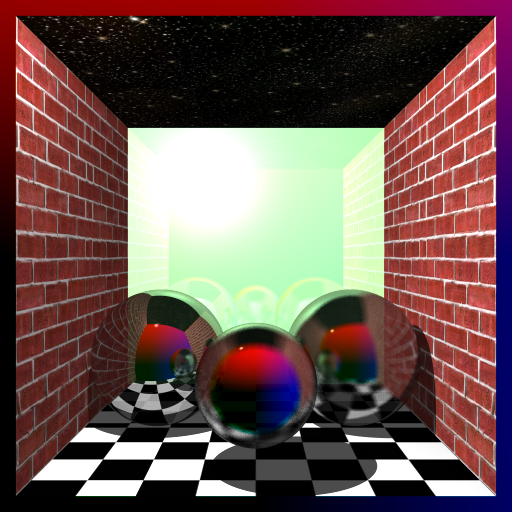

# CS488 Final Project by Nimun Bajwa

Enhanced ray tracer in C++ that successfully simulates paths of light to create realistic rendering of 3D Lua scenes
Provided support for complex primitives, texture mapping, light reflection and refraction, transparent surfaces, and shadows

### How to run:

1. Run "premake5 gmake" in ./final_proj
2. Run "make" in ./final_proj
3. Navigate to ./final_proj/Assets
4. Run ../final [lua scene]
    e.g. FINALSCENE.lua

### Objectives implemented:
- primitives
- anti aliasing
- texture mapping
- glossy reflection
- final scene
- refraction (sort of)

# CS 488 Ray Tracer Demo

## New Primitives
Cones, Cylinders, and Planes were added as new primitives to the modeling language. They were implemented by finding using their implicit equations in the intersection test.

<table>
  <tr>
    <td align="center">
      
    </td>
  </tr>
  <tr>
    <td align="center">
      
    </td>
    <td align="center">
      
    </td>
  </tr>
</table>

## Texture Mapping
Texture mapping was implemented for spheres, cylinders, cones, and planes. For spheres, spherical coordinates are used. Cones and cylinders both use cylindrical coordinates.

<table>
  <tr>
    <td align="center">
      
    </td>
    <td align="center">
      
    </td>
  </tr>
  <tr>
    <td align="center">
      
    </td>
    <td align="center">
      
    </td>
  </tr>
  <tr>
    <td align="center">
      
    </td>
    <td align="center">
      
    </td>
  </tr>
</table>

## Refraction
Refraction was implemented by calculating the refracted ray from Snell's law, and recursively sending these refraction rays. These rays contributed to the color decision using Fresnel's coefficient. To prevent infinite recursion, there was a maximum depth limit to how many times a ray can be reflected or refracted.

<table>
  <tr>
    <td align="center">
      
    </td>
  </tr>
  <tr>
    <td align="center">
      
    </td>
    <td align="center">
      
    </td>
  </tr>
</table>

## Glossy Reflection
Glossy reflection was implemented by adding glossiness to the gr.material command as a parameter. Multiple "glossy" reflection rays were then sent after perturbing their surface normals randomly.

<table>
  <tr>
    <td align="center">
      
    </td>
    <td align="center">
      
    </td>
  </tr>
</table>

## Anti-Aliasing
Anti-aliasing was implemented in the form of regular sampling. This was done by sampling multiple points within a given pixel, and averaging the color for the pixel.

<table>
  <tr>
    <td align="center">
      
    </td>
    <td align="center">
      
    </td>
  </tr>
  <tr>
    <td align="center">
      
    </td>
    <td align="center">
      
    </td>
  </tr>
  <tr>
    <td align="center">
      
    </td>
    <td align="center">
      
    </td>
  </tr>
</table>

## Final Scene
Incorporates texture mapping, reflection, refraction, primitives, glossy reflection. Was meant to simulate an art gallery.

## Extra Objective: Reflection
Note: This was my extra objective in A4.
Implemented by using Snell's law to calculate the reflected ray, and recursively incorporating that in the color calculation according to Fresnel's coefficient.

<table>
  <tr>
    <td align="center">
      
    </td>
    <td align="center">
      
    </td>
  </tr>
</table>
